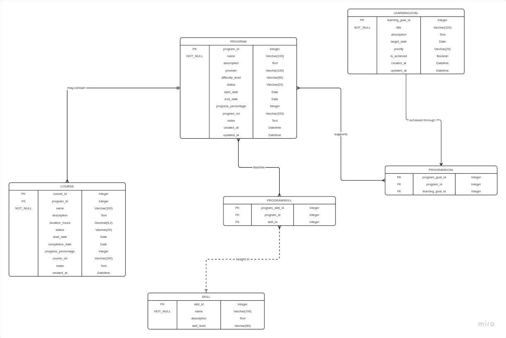

Self Learning Tracker app

## Project Overview

This app is a simple Django web application that helps users track their learning goals and progress.

## Entity Relationship Diagram 

## Features

**Add:** Create new items to the list
**List:** View all items in the list
**Edit:** Update existing items in the list
**Delete:** Delete items from the list

## Prerequisites

Before running the application, make sure you have the following installed:

- Python 3.8 or higher
- Django 4.2 or higher
- pip (Python package manager)

## Project Structure

The project is structured as follows:

django-learning-tracker/
│
├── learning_tracker/               
│   ├── migrations/
│   ├── static/
│       ├── Learning_tracker/
│       │   ├── styles.css    
│   ├── models.py          
│   ├── views.py           
│   ├── urls.py             
│   └── templates/  
│       ├── learning_tracker/
│       │   └── list_programs.html  
│       │   └── detail_program.html 
│       │   └── edit_program.html 
│       │   └── delete_program.html 
│       │   └── detail_course.html 
│       │   └── edit_course.html 
│       │   └── delete_course.html 
│       │   └── detail_skill.html 
│       │   └── edit_skill.html 
│       │   └── delete_skill.html 
│       │   └── detail_learning_goal.html 
│       └── edit_learning_goal.html 
│       └── delete_learning_goal.html 
│
├── manage.py               
├── db.sqlite3              
└── README.md               

## AI Usage 

Since this is a self learning project, I used AI as follows:
- Generating code for styles.css
- Correcting models.py
- Correcting url links
- Debugging errors in views.py

## Live Demo

